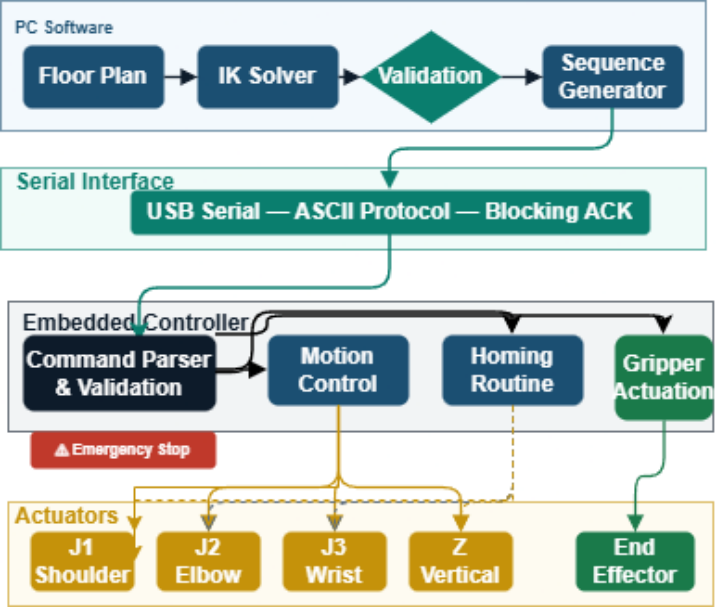
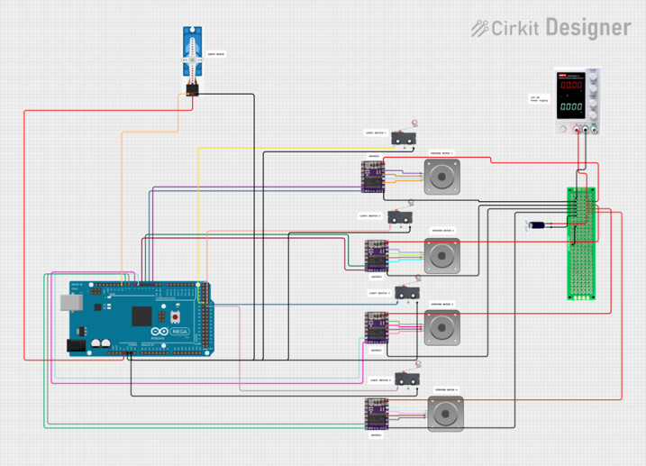
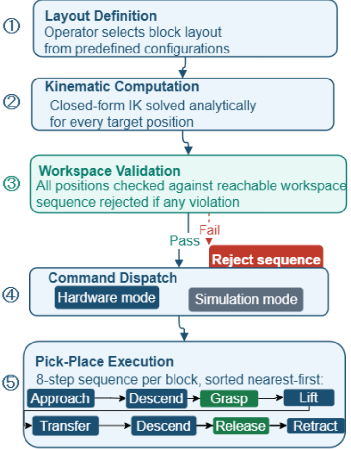

# SCARA Autonomous Assembly Robot

A 4-DOF SCARA block-assembly project developed at Heriot-Watt University. A Python controller converts a floor plan into a sequence of pick-and-place commands, sent to Arduino firmware over serial.

**[Watch the project demo](https://drive.google.com/file/d/1bch_skkfbKCsSWpbhE6QLBJJI1j0O4o6/view?usp=sharing)**

<p align="center">
  
</p>

*System architecture from the April 2026 report. The emergency-stop path is a design description; current limit-switch behaviour is documented in the [implementation notes](docs/system_architecture.md).*

**Python control · Arduino Mega 2560 · Four motion axes · Block assembly**

## My contribution

I designed the system architecture and implemented all embedded firmware and Python control software, except the inverse kinematics code.

My work covered the embedded controller, Python application, serial communication and integration of the control layers into the assembly workflow. The inverse kinematics implementation was contributed separately; I do not claim authorship of that code.

## Engineering highlights

- Grid-based floor plans and an interactive preset editor.
- Inverse kinematics and target reachability validation before homing.
- One- or two-layer build sequencing, with a Z rehome between layers.
- Separate serial interfaces for physical hardware and an offline command rehearsal.
- Arduino Mega 2560 firmware configured through PlatformIO.

The demo link shows the project in action. A dry run exercises the Python command sequence using simulated acknowledgements; it does not measure placement accuracy or prove physical reliability.

## Inside the system

### Electronics



*Circuit figure from the project report. It shows the original single-supply layout; the tested dual-supply arrangement is described in the [electronics notes](electronics/bill-of_materials.md).*

### From floor plan to motion



*Report-stage software workflow. The current entry point follows the loaded grid order; nearest-first ordering in this figure is not established by the current implementation.*

## Results at a glance

| Evidence | Result |
| --- | --- |
| Python tests | 59 reported in the April 2026 report |
| Offline example | Two-block command rehearsal completed |
| Four-motor supply voltage | 7.8 V with one supply; 11.7 V after the dual-supply change |
| Physical positioning error | Approximately 5–8 mm at report stage |
| Full autonomous physical build | Pending at report stage |

## Try it without hardware

Use Python 3.10 or newer. From the repository root:

```bash
cd high_level_control
python3 main.py --floor example_floor_plan.txt --dry-run --layers 1
```

The supplied example selects two blocks. The offline run should finish with a two-block completion message. No serial device or third-party Python package is required for this path.

For the interactive editor:

```bash
python3 main.py --dry-run
```

See the [controller guide](high_level_control/ReadMe.md) for the floor-plan format and options.

## Hardware setup

Review the machine-specific geometry, joint settings, heights and serial settings in [config.py](high_level_control/config.py) before operating the robot.

Install the serial dependency and run from the controller directory:

```bash
python3 -m pip install pyserial
python3 main.py --floor example_floor_plan.txt --port COM5 --layers 1
```

Replace COM5 with the connected controller's port. This command homes and moves the physical robot.

The firmware is [firmware/src/main.cpp](firmware/src/main.cpp). With PlatformIO installed, build it from the repository root:

```bash
python3 -m platformio run --project-dir firmware -e megaatmega2560
```

The board and dependencies are defined in [firmware/platformio.ini](firmware/platformio.ini).

## Code map

| Component | Entry point |
| --- | --- |
| CLI and sequencing orchestration | [main.py](high_level_control/main.py) |
| Floor-plan file handling | [grid.py](high_level_control/grid.py) |
| Presets and interactive editor | [presets.py](high_level_control/presets.py), [editor.py](high_level_control/editor.py) |
| Kinematics and reachability | [kinematics.py](high_level_control/kinematics.py) |
| Pick-and-place sequence | [builder.py](high_level_control/builder.py) |
| Offline and real serial interfaces | [serial_comms.py](high_level_control/serial_comms.py) |
| Existing software tests | [tests](high_level_control/tests/) |

## Evidence and current limits

The April 2026 project report records 59 Python unit tests, individual motor testing and electrical load testing. It reports approximately 5–8 mm positioning error against a ±1.5 mm target; a full autonomous physical build was still pending at that stage. These are report-stage results, not new hardware measurements.

## Project documentation

- [System architecture](docs/system_architecture.md): control-flow diagram, PC/firmware responsibilities, command interface and current implementation details.
- [Electronics and bill of materials](electronics/bill-of_materials.md): component inventory, firmware pin assignments and reported power measurements.
- [Testing and results](docs/testing_and_results.md): reported test coverage, offline example, physical accuracy and engineering lessons.

The editable circuit schematic and mechanical CAD are not supplied here. The 2D visualiser remains an empty placeholder; the offline example is a serial-command rehearsal.

Developed at Heriot-Watt University, academic year 2025–2026.
