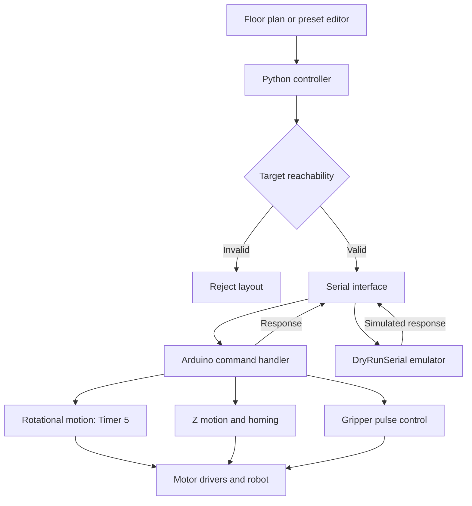

# System architecture

The system separates floor-plan handling and sequencing on a PC from motor pulse generation on an Arduino Mega 2560.

## PC layer

[main.py](../high_level_control/main.py) loads a floor plan or opens the editor, validates target positions, selects the serial interface, homes the robot and sequences one or two layers.

| Responsibility | Implementation |
| --- | --- |
| Geometry, grid and robot constants | [config.py](../high_level_control/config.py) |
| Floor-plan parsing | [grid.py](../high_level_control/grid.py) |
| Presets and editing | [presets.py](../high_level_control/presets.py), [editor.py](../high_level_control/editor.py) |
| Kinematics and reachability | [kinematics.py](../high_level_control/kinematics.py) |
| Pickup/place sequence | [builder.py](../high_level_control/builder.py) |
| Hardware and offline interfaces | [serial_comms.py](../high_level_control/serial_comms.py) |

Each block follows approach, descend, grasp, lift, transfer, descend, release and retract. DryRunSerial returns synthetic acknowledgements; it rehearses control flow without modelling physical success.

## Embedded layer

[firmware/src/main.cpp](../firmware/src/main.cpp) stores joint settings in JOINTS[] and handles newline-terminated commands over serial at 115200 baud.

| Command | Function |
| --- | --- |
| HOME | Home axes |
| MOVE:j1,j2,j3,z_mm | Validate target ranges and execute motion |
| REHOME_Z:z_mm | Rehome Z and offset by layer height |
| GRIP / RELEASE | Close / open gripper |
| SET_SPEED:v / SET_ACCEL:a | Configure motion profile |
| STATUS | Return motion status |

The rotational joints use Timer 5 with a ramped velocity profile and Bresenham-style integer accumulators for pulse distribution. The speed calculation itself uses floating-point arithmetic and sqrtf inside the interrupt routine.

In the current implementation, startMove() completes the rotational move before executing blocking Z motion. It does not synchronise all four axes simultaneously.

The gripper uses manually generated pulses during angle changes and Timer 4 to hold its position. This separates gripper timing from Timer 5 motion generation.

## Homing, startup and acknowledgements

Homing polls each limit input and includes a timeout. Startup calls homeAll(), opens and closes the gripper, then prints READY; powering or resetting the controller can therefore cause motion.

MOVE acknowledges completion of the commanded step sequence, not measured arrival at the target. Position tracking is open-loop.

The report describes interrupt-driven limit halting, but the current source defines limit interrupt handlers without attaching them, and normal motion does not check the limit flags. This documentation does not claim an active general-purpose limit-switch halt.

HOME and REHOME_Z currently emit their OK response after calling their helpers even when a helper reports a homing timeout. A positive acknowledgement alone is therefore insufficient evidence of successful homing.

## Mechanical arrangement

The report describes an RPRR mechanism: base rotation, a central vertical lead-screw stage, elbow rotation and wrist rotation. In software, the rotational axes are named J1, J2 and J3, with the vertical axis named Z.

## Evidence

See [testing and results](testing_and_results.md) and the [electronics overview](../electronics/bill-of_materials.md).

Source: Team ED5, *Design and Development of a SCARA Robot Prototype for Autonomous Block Placement*, B51RO, 15 April 2026, supplied project report. Reported measurements below are historical results, not new tests.
